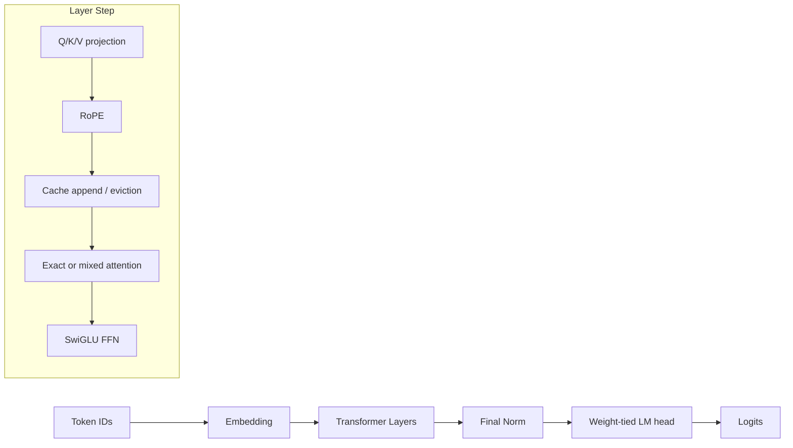
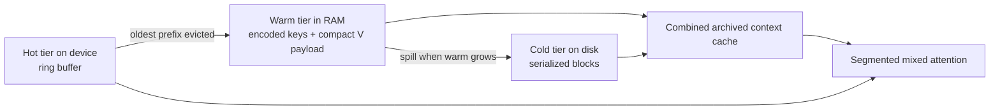

# rfsn-MLX

An MLX-native transformer inference engine for Apple Silicon with tiered KV caching, compressed long-context archival, grouped-query attention, and an FP8 cache-storage path.

> Status: inference backend and benchmark harness. The exact path, compressed archive path, packed FP8 cache mode, CLI smoke checks, and regression tests are implemented. Tokenizer integration, batching/service orchestration, and custom Metal kernels are intentionally left out of this repository.

## Highlights

| Area | What is implemented | Why it matters |
| --- | --- | --- |
| Exact attention | MLX-based exact attention is the semantic reference path | Keeps correctness anchored while optimizations evolve |
| Long-context archive | Hot KV overflow is evicted into warm RAM and cold disk tiers | Lets decode continue beyond device-resident context limits |
| Compression | PQ + RVQ are used to compact archived keys | Reduces archive footprint while keeping reconstruction vectorized |
| FP8 cache mode | `cache_dtype=fp8_e4m3` stores hot and archived values in 1-byte form | Cuts cache memory pressure on runtimes without native float8 |
| GQA support | `num_kv_heads` can be smaller than `num_heads` | Matches modern LLM attention layouts |
| Decode-path optimization | Mixed-context attention operates on cached segments instead of rebuilding full context each step | Removes a major per-token reconstruction cost |
| Benchmarking | Built-in smoke checks plus prefill/decode timing helpers | Makes regressions easy to catch locally |

## Architecture



### Cache pipeline



### Performance-oriented design choices

- RoPE tables are hoisted once per forward call and reused across layers.
- The hot tier is a preallocated ring buffer, so append is constant-time and avoids compaction copies.
- Archived RVQ metadata is stored in fixed-width tensors instead of Python-managed sparse objects.
- Decode uses archived and hot attention segments directly instead of rebuilding one monolithic context tensor every token.
- Archived context reuse is cached at the combined archive level, avoiding duplicate per-block reconstructed tensors staying resident.

## What the repository is for

This project is best thought of as an inference-systems playground with real engineering constraints:

- exact short-context inference
- compressed long-context inference once hot capacity is exceeded
- experimentation with cache storage dtypes separate from model dtypes
- loading HuggingFace-style LLaMA/Mistral checkpoints
- benchmarking prefill and decode behavior on Apple Silicon

It is not currently a full serving stack. There is no bundled tokenizer, HTTP API, request batching layer, scheduler, or distributed runtime.

## Requirements

- macOS on Apple Silicon
- Python 3.10+
- `mlx`
- `numpy`
- optional: `safetensors` if you want to load external checkpoints outside MLX-native formats

## Install

```bash
python3 -m venv .venv
source .venv/bin/activate
python -m pip install --upgrade pip
python -m pip install mlx numpy safetensors
```

If you only need random-weight smoke checks and do not plan to load checkpoints, `safetensors` is optional.

## Quick start

### 1. Smoke-test the engine

```bash
python -m rfsn_v10_5.launcher check
python -m rfsn_v10_5.launcher check --cache-dtype fp8_e4m3
```

Expected shape of the output:

```text
[check] Config: dtype=float32, cache_dtype=fp8_e4m3
[check] Prefill OK, logits shape: (1, 8, 1000)
[check] Decode OK, 5 steps completed
[check] PASS
```

### 2. Run a tiny benchmark

```bash
python -m rfsn_v10_5.launcher bench \
  --hidden-dim 128 \
  --num-heads 2 \
  --num-kv-heads 2 \
  --head-dim 64 \
  --num-layers 1 \
  --vocab-size 128 \
  --prompt-len 8 \
  --decode-steps 8 \
  --warmup 1 \
  --repeats 1 \
  --model-dtype float16 \
  --cache-dtype fp8_e4m3
```

Example output from the tiny validation configuration used in this workspace:

```text
[bench] Model: 1L x 128d, 2H/2KVH, dtype=float16, cache_dtype=fp8_e4m3
prefill(len=8): mean=2.1ms  min=2.1ms  max=2.1ms  throughput=3773.1 tok/s
decode(steps=8): mean=13.6ms  min=13.6ms  max=13.6ms  throughput=587.6 tok/s
```

Treat those numbers as sanity-check output, not a throughput claim for real model sizes.

### 3. Generate from a checkpoint

```bash
python -m rfsn_v10_5.launcher generate \
  --checkpoint /path/to/model.safetensors \
  --hidden-dim 4096 \
  --num-heads 32 \
  --num-kv-heads 8 \
  --head-dim 128 \
  --num-layers 32 \
  --vocab-size 32000 \
  --prompt-ids 1,29871,518,29914 \
  --max-new-tokens 64 \
  --temperature 0.8 \
  --top-p 0.95 \
  --top-k 50 \
  --cache-dtype fp8_e4m3
```

Notes:

- `--prompt` uses ASCII codepoints as a demo fallback, not a real tokenizer.
- For real usage, prefer `--prompt-ids` from your own tokenizer pipeline.
- The `bench` subcommand uses random weights; only `generate` needs a checkpoint.

## Python API

### Minimal prefill + decode loop

```python
import mlx.core as mx

from rfsn_v10_5 import RFSNCache, RFSNConfig, RFSNMLX, RuntimeMode

config = RFSNConfig(
    hidden_dim=512,
    num_heads=8,
    num_kv_heads=8,
    head_dim=64,
    num_layers=4,
    vocab_size=32000,
    runtime_mode=RuntimeMode.COMPRESSED,
    model_dtype="bfloat16",
    cache_dtype="fp8_e4m3",
)

model = RFSNMLX(config)
cache = RFSNCache(config, batch_size=1)

prompt_ids = mx.array([[1, 2, 3, 4]], dtype=mx.int32)
logits = model.prefill(prompt_ids, cache)
mx.eval(logits)

token = mx.argmax(logits[:, -1, :], axis=-1).astype(mx.int32)
pos = prompt_ids.shape[1]

for _ in range(8):
    logits = model.decode_step(token, cache, pos)
    mx.eval(logits)
    token = mx.argmax(logits, axis=-1).astype(mx.int32)
    pos += 1
```

### Loading HuggingFace-style weights

```python
from rfsn_v10_5 import RFSNConfig, RFSNMLX
from rfsn_v10_5.loader import load_hf_weights

config = RFSNConfig(
    hidden_dim=4096,
    num_heads=32,
    num_kv_heads=8,
    head_dim=128,
    num_layers=32,
    vocab_size=32000,
    model_dtype="bfloat16",
)

model = RFSNMLX(config)
load_hf_weights(model, "/path/to/model.safetensors", strict=False)
```

Supported checkpoint formats:

- `.safetensors`
- `.npz`

The loader remaps common LLaMA/Mistral key names into the local module layout and skips `lm_head.weight` because the LM head is weight-tied to embeddings.

### Benchmark helpers

```python
from rfsn_v10_5.bench import bench_decode, bench_prefill

prefill = bench_prefill(model, cache, prompt_len=256, warmup=2, repeats=5)
decode = bench_decode(model, cache, steps=100, warmup=5, repeats=3)

print(prefill)
print(decode)
```

Use `archive_seed_steps` in `bench_decode(...)` when you explicitly want the timed decode loop to run with archived context already present.

## Configuration guide

### Core architectural invariants

`RFSNConfig` validates several constraints up front:

- `hidden_dim == num_heads * head_dim`
- `num_subspaces * subspace_dim == head_dim`
- `hot_capacity <= warm_capacity <= cold_capacity`
- `num_heads % num_kv_heads == 0`
- `block_size_seq > 0`

### Important runtime knobs

| Field | Meaning |
| --- | --- |
| `runtime_mode` | `exact` keeps only the hot cache; `compressed` archives overflow and reuses it during decode |
| `model_dtype` | Weight and activation dtype for the model path |
| `cache_dtype` | Storage dtype for KV cache; defaults to `model_dtype`; accepts `fp8_e4m3` |
| `num_kv_heads` | Enables grouped-query attention when smaller than `num_heads` |
| `hot_capacity` | Max tokens kept device-resident per layer |
| `warm_capacity` | Max archived tokens kept in RAM before spilling blocks onward |
| `cold_capacity` | Upper bound tracked for disk-tier archival |
| `block_size_seq` | Eviction/compression granularity |
| `rvq_max_active` | Fixed-width budget for archived RVQ residual entries |

### Choosing cache dtypes

- `float16`: good default for low memory use with minimal complexity
- `bfloat16`: safer numeric range on supported workloads
- `float32`: easiest debug mode
- `fp8_e4m3`: one-byte cache storage, implemented as native float8 if MLX exposes it or as a packed `uint8` software fallback otherwise

The FP8 path is a cache-storage optimization, not a full-model FP8 execution path.

## Repository layout

```text
rfsn_v10_5/
  __init__.py
  attention_compressed.py
  attention_exact.py
  bench.py
  cache.py
  codec.py
  config.py
  fp8.py
  launcher.py
  layer.py
  loader.py
  model.py
  types.py
tests/
  test_cache_dtype.py
  test_launcher.py
  test_performance.py
```

Module roles:

- `config.py`: validated runtime and architecture config
- `cache.py`: hot/warm/cold KV cache, eviction, archive reuse, FP8 storage plumbing
- `codec.py`: PQ + RVQ encoding and decode helpers for archived keys
- `attention_exact.py`: exact attention and segmented attention utilities
- `attention_compressed.py`: mixed archived + hot attention path
- `layer.py`: per-layer projections, cache updates, attention routing, SwiGLU FFN
- `model.py`: full model orchestration, prefill, decode, generation
- `loader.py`: checkpoint remapping and loading
- `bench.py`: prefill/decode timing helpers
- `launcher.py`: CLI entry point

## Testing

Run the focused regression suite:

```bash
python -m unittest tests.test_launcher tests.test_cache_dtype tests.test_performance
```

What these tests cover:

- launcher config plumbing and smoke command behavior
- packed FP8 hot-cache storage and round-trip correctness
- archived warm/cold payload storage in compact `uint8` form
- combined archived-context cache reuse across decode steps
- archived decode performance smoke path, including capture-artifact fallback when the runtime lacks usable profiling hooks

## Current limitations

- Apple Silicon only, because MLX is the execution backend.
- No tokenizer is bundled.
- Compressed prefill for a single prompt chunk larger than `hot_capacity` is not implemented; large prompts should be chunked before prefill.
- The profiling/capture smoke path falls back to a text artifact on runtimes where `mx.profiler` or Metal capture cannot start.
- `cold_capacity` is enforced as a limit signal, but full cold-tier eviction policy is still a future design choice.
- This repo focuses on inference; there is no training or fine-tuning pipeline.

## Where to extend next

- chunked prefill for very long prompts
- a real tokenizer adapter and text decoding layer
- continuous batching / serving wrapper
- richer profiling once runtime support is available
- deeper kernel-level optimization if MLX graph-level improvements stop being enough

## License and project notes

No license file is included in the current workspace snapshot. If you plan to publish or redistribute the project, add one explicitly.