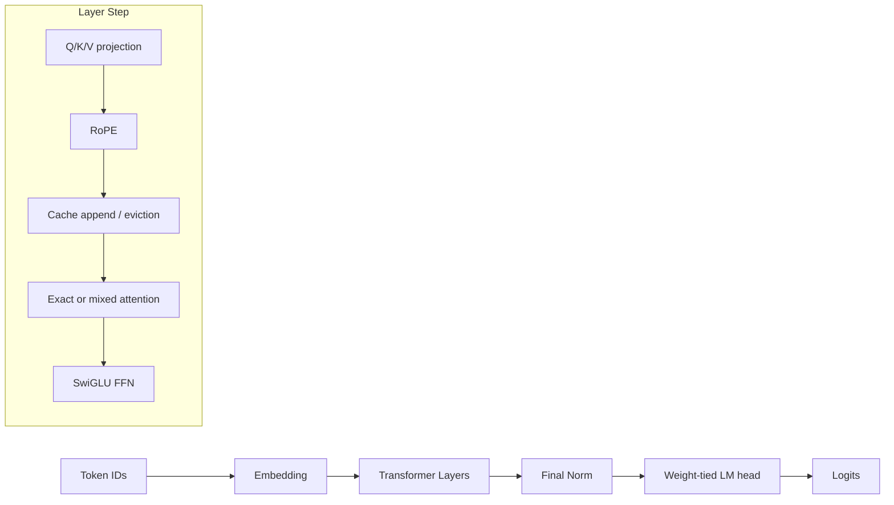
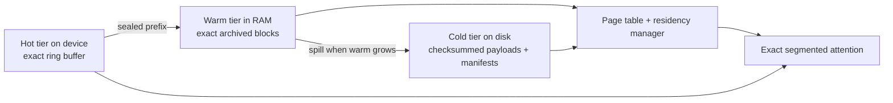

# rfsn-MLX

An MLX-native transformer inference engine for Apple Silicon with exact retained-context semantics, exact archived KV spill, session-scoped restart restore, corruption-safe block storage, grouped-query attention, and tokenizer-backed CLI/API surfaces.

> Status: the V11 exact block-managed runtime is implemented. Exact hot-window mode, exact archived spill/reload, session-scoped restart restoration, chunked prefill, HF config auto-loading, chat-template message input, and a thin single-request FastAPI wrapper are in place. Continuous batching and custom Metal kernels remain future work.

## Highlights

| Area | What is implemented | Why it matters |
| --- | --- | --- |
| Exact segmented attention | The active runtime path uses exact attention over archived segments plus the hot window | Preserves retained-context semantics without lossy reconstruction on the hot path |
| Block-managed archive | Hot KV overflow is sealed into exact archived blocks tracked by a page table | Makes long-context residency explicit and inspectable |
| Corruption-safe persistence | Archived blocks are stored as `.npz` payloads plus checksummed manifests | Missing or corrupt cold blocks do not take down the runtime |
| Session-scoped restoration | Persisted blocks are rebuilt only for an explicit session ID under a matching model identity | Prevents cross-session archive bleed and makes restore intent explicit |
| GQA support | `num_kv_heads` can be smaller than `num_heads` | Matches modern LLM attention layouts |
| Decode-path optimization | Attention consumes cached segments directly instead of rebuilding a monolithic archive tensor every token | Removes a major per-token reconstruction cost |
| Benchmarking | Built-in smoke checks plus prefill/decode timing helpers | Makes regressions easy to catch locally |

## Architecture



### Cache pipeline



### Performance-oriented design choices

- RoPE tables are hoisted once per forward call and reused across layers.
- The hot tier is a preallocated ring buffer, so append is constant-time and avoids compaction copies.
- Archived context is tracked by manifests and a page table rather than a monolithic reconstructed archive tensor.
- Cold blocks are loaded lazily, and decode can prefetch adjacent blocks when it detects sequential access.
- Persisted cache state can be restored into a fresh cache when the model identity and config match.

## What the repository is for

This project is best thought of as an inference-systems playground with real engineering constraints:

- exact short-context inference
- exact long-context inference once hot capacity is exceeded
- disk-backed KV persistence with corruption handling and restart restoration
- session-scoped archived-context persistence and restart restore
- loading HuggingFace-style LLaMA/Mistral checkpoints
- benchmarking prefill and decode behavior on Apple Silicon

It is not currently a full serving stack. A thin HTTP API and tokenizer-backed CLI are included, but there is still no request batching layer, scheduler, or distributed runtime. The repo now exposes only the exact block-managed archive path.

## Requirements

- macOS on Apple Silicon
- Python 3.10+
- `mlx`
- `numpy`
- `transformers` for tokenizer-backed text generation
- `fastapi` and `uvicorn` for the HTTP wrapper
- optional: `safetensors` if you want to load external checkpoints outside MLX-native formats

## Install

```bash
python3 -m venv .venv
source .venv/bin/activate
python -m pip install --upgrade pip
```

Minimal local runtime for smoke checks and benchmarks:

```bash
python -m pip install -r requirements-core.txt
```

Full local runtime for checkpoint loading, tokenizer-backed text I/O, and HTTP serving:

```bash
python -m pip install -r requirements.txt
```

If you only need random-weight smoke checks and do not plan to load checkpoints, `requirements-core.txt` is enough. If you only plan to drive the engine with `--prompt-ids`, tokenizer-backed text I/O remains optional.

### Apple Silicon notes

- MLX handles Apple Silicon acceleration automatically; there is no CUDA setup path in this repo.
- This project targets the MLX runtime on Apple Silicon, not a guaranteed explicit Neural Engine execution path.
- On an M1, M2, or M3 Mac, the recommended operator flow is `check` -> `bench` -> `generate` or `serve`.

## Quick start

### 1. Smoke-test the engine

```bash
python -m rfsn_v10_5.launcher check
```

Expected shape of the output:

```text
[check] Config: dtype=float32, runtime_mode=archived, session_id=<generated>
[check] Prefill OK, logits shape: (1, 8, 1000)
[check] Decode OK, 5 steps completed
[check] PASS
```

### 2. Run a tiny benchmark

```bash
python -m rfsn_v10_5.launcher bench \
  --hidden-dim 128 \
  --num-heads 2 \
  --num-kv-heads 2 \
  --head-dim 64 \
  --num-layers 1 \
  --vocab-size 128 \
  --prompt-len 8 \
  --decode-steps 8 \
  --warmup 1 \
  --repeats 1 \
  --model-dtype float16
```

Example output from the tiny validation configuration used in this workspace:

```text
[bench] Model: 1L x 128d, 2H/2KVH, dtype=float16, runtime_mode=archived, session_id=<generated>
prefill(len=8): mean=2.1ms  min=2.1ms  max=2.1ms  throughput=3773.1 tok/s
decode(steps=8): mean=13.6ms  min=13.6ms  max=13.6ms  throughput=587.6 tok/s
```

Treat those numbers as sanity-check output, not a throughput claim for real model sizes.

### 3. Generate from a checkpoint

```bash
python -m rfsn_v10_5.launcher generate \
  --checkpoint /path/to/model-or-directory \
  --tokenizer /path/to/tokenizer-or-hf-id \
  --hidden-dim 4096 \
  --num-heads 32 \
  --num-kv-heads 8 \
  --head-dim 128 \
  --num-layers 32 \
  --vocab-size 32000 \
  --ffn-dim 14336 \
  --rope-base 500000 \
  --prompt "Once upon a time" \
  --session-id story-session \
  --max-new-tokens 64 \
  --temperature 0.8 \
  --top-p 0.95 \
  --top-k 50
```

Notes:

- `--checkpoint` accepts a single `.safetensors` or `.npz` file, a sharded `*.safetensors.index.json`, or a local model directory containing those files.
- `--tokenizer` accepts a HuggingFace tokenizer ID or a local tokenizer path.
- If a checkpoint path contains a supported `config.json`, launcher config is auto-loaded unless `--no-hf-config` is set.
- `--messages-json` accepts a JSON array of chat messages and formats it through the tokenizer template.
- `--prompt-ids` remains available as the low-level escape hatch when you already have token IDs.
- `--disk-cache-dir` controls where archived KV blocks are persisted.
- `--restore-cache` restores persisted KV blocks from `--disk-cache-dir` before generation; use it only when the supplied input is continuation context, not a replayed full prompt.
- `--session-id` is required together with `--restore-cache`. If you do not provide one for a fresh request, the launcher generates a new session ID and prints it.
- Some checkpoints need non-default architecture settings such as `--ffn-dim` or `--rope-base`; use the checkpoint's `config.json` values when they differ from the defaults.
- Text prompts require `--tokenizer`; otherwise use `--prompt-ids` directly.
- The `bench` subcommand uses random weights; only `generate` needs a checkpoint.

### 4. Run the HTTP API

```bash
python -m rfsn_v10_5.launcher serve \
  --checkpoint /path/to/model-or-directory \
  --tokenizer /path/to/tokenizer-or-hf-id \
  --hidden-dim 4096 \
  --num-heads 32 \
  --num-kv-heads 8 \
  --head-dim 128 \
  --num-layers 32 \
  --vocab-size 32000 \
  --ffn-dim 14336 \
  --rope-base 500000 \
  --host 127.0.0.1 \
  --port 8000
```

Example requests:

```bash
curl -X POST http://127.0.0.1:8000/generate \
  -H 'content-type: application/json' \
  -d '{"prompt":"Once upon a time","max_new_tokens":32}'

curl -N -X POST http://127.0.0.1:8000/generate/stream \
  -H 'content-type: application/json' \
  -d '{"prompt":"Once upon a time","max_new_tokens":8}'
```

### API schema

`GET /health`

Response body:

```json
{
  "status": "ok",
  "vocab_size": 32000,
  "max_position_embeddings": 131072,
  "disk_cache_dir": "./rfsn_disk_cache",
  "default_session_id": null,
  "tokenizer_loaded": true,
  "admission_control": {
    "max_concurrent_requests": 1,
    "max_queue_size": 0,
    "active_requests": 0,
    "queued_requests": 0
  }
}
```

`POST /generate`

Request body:

```json
{
  "prompt": "Once upon a time",
  "messages": [{"role": "user", "content": "Once upon a time"}],
  "prompt_ids": [1, 2, 3],
  "session_id": "story-session",
  "restore_cache": false,
  "max_new_tokens": 32,
  "temperature": 0.8,
  "top_p": 0.95,
  "top_k": 50,
  "repetition_penalty": 1.0
}
```

Use either `prompt` or `prompt_ids`. Response body:

```json
{
  "session_id": "story-session",
  "prompt_token_count": 4,
  "generated_token_count": 32,
  "token_ids": [1, 2, 3, 4, 5],
  "text": "Once upon a time ...",
  "generated_text": "..."
}
```

Use one of `prompt`, `messages`, or `prompt_ids`. Set `restore_cache` only when the supplied input should be appended to persisted context already stored in `disk_cache_dir`. `session_id` is required for restore and optional for fresh requests.

`POST /generate/stream`

The request body matches `/generate`. The route emits Server-Sent Events with:

- `token`: `{"step": 1, "token_id": 7, "text": "hello"}`
- `complete`: `{"session_id": "story-session", "token_ids": [...], "generated_token_count": 32, "text": "...", "generated_text": "..."}`

The streaming route emits Server-Sent Events. It is still single-request-at-a-time inference and does not implement continuous batching.

## Python API

### Minimal prefill + decode loop

```python
import mlx.core as mx

from rfsn_v10_5 import RFSNCache, RFSNConfig, RFSNMLX, RuntimeMode

config = RFSNConfig(
    hidden_dim=512,
    num_heads=8,
    num_kv_heads=8,
    head_dim=64,
    num_layers=4,
    vocab_size=32000,
  runtime_mode=RuntimeMode.ARCHIVED,
    model_dtype="bfloat16",
  session_id="python-session",
)

model = RFSNMLX(config)
cache = RFSNCache(config, batch_size=1)

prompt_ids = mx.array([[1, 2, 3, 4]], dtype=mx.int32)
logits = model.prefill(prompt_ids, cache)
mx.eval(logits)

token = mx.argmax(logits[:, -1, :], axis=-1).astype(mx.int32)
pos = prompt_ids.shape[1]

for _ in range(8):
    logits = model.decode_step(token, cache, pos)
    mx.eval(logits)
    token = mx.argmax(logits, axis=-1).astype(mx.int32)
    pos += 1
```

### Loading HuggingFace-style weights

```python
from rfsn_v10_5 import RFSNConfig, RFSNMLX
from rfsn_v10_5.loader import load_hf_weights

config = RFSNConfig(
    hidden_dim=4096,
    num_heads=32,
    num_kv_heads=8,
    head_dim=128,
    num_layers=32,
    vocab_size=32000,
    model_dtype="bfloat16",
)

model = RFSNMLX(config)
load_hf_weights(model, "/path/to/model.safetensors", strict=False)
```

Supported checkpoint formats:

- `.safetensors`
- `.npz`

The loader remaps common LLaMA/Mistral key names into the local module layout and skips `lm_head.weight` because the LM head is weight-tied to embeddings.

### Benchmark helpers

```python
from rfsn_v10_5.bench import bench_decode, bench_prefill

prefill = bench_prefill(model, cache, prompt_len=256, warmup=2, repeats=5)
decode = bench_decode(model, cache, steps=100, warmup=5, repeats=3)

print(prefill)
print(decode)
```

Use `archive_seed_steps` in `bench_decode(...)` when you explicitly want the timed decode loop to run with archived context already present.

### FastAPI wrapper

```python
from rfsn_v10_5 import RFSNConfig, RuntimeMode, create_app

config = RFSNConfig(
  hidden_dim=512,
  num_heads=8,
  num_kv_heads=8,
  head_dim=64,
  num_layers=4,
  vocab_size=32000,
  runtime_mode=RuntimeMode.ARCHIVED,
  session_id="service-default",
)

app = create_app(
  config,
  checkpoint="/path/to/model.safetensors",
  tokenizer_name_or_path="/path/to/tokenizer-or-hf-id",
)
```

Send `restore_cache: true` in a `/generate` or `/generate/stream` request when you want the request cache to rebuild any persisted blocks before processing the supplied continuation input.

## Configuration guide

### Core architectural invariants

`RFSNConfig` validates several constraints up front:

- `hidden_dim == num_heads * head_dim`
- `hot_capacity <= warm_capacity <= cold_capacity`
- `num_heads % num_kv_heads == 0`
- `block_size_seq > 0`

### Important runtime knobs

| Field | Meaning |
| --- | --- |
| `runtime_mode` | `exact` keeps all live context in the hot window; `archived` spills exact sealed prefixes into archived blocks |
| `model_dtype` | Weight and activation dtype for the model path |
| `num_kv_heads` | Enables grouped-query attention when smaller than `num_heads` |
| `hot_capacity` | Max tokens kept device-resident per layer |
| `warm_capacity` | Max archived tokens kept in RAM before spilling blocks onward |
| `cold_capacity` | Maximum retained archived tokens across disk-tier blocks; excess cold blocks are pruned |
| `block_size_seq` | Archival sealing granularity |
| `disk_cache_dir` | Root directory for persisted archived KV blocks and their manifests |
| `session_id` | Explicit archive namespace. Required for restore, optional for new sessions |

### Session semantics

- Fresh CLI/API requests can omit `session_id`; a new one is generated and surfaced in the response/output.
- Restore requires an explicit `session_id`.
- Persisted archives live under `disk_cache_dir / model_id / session_id / layer_*`, so different sessions for the same model do not see each other's archived context.

## Repository layout

```text
rfsn_v10_5/
  __init__.py
  api.py
  attention_exact.py
  bench.py
  block_manager.py
  cache.py
  config.py
  hf_config.py
  launcher.py
  layer.py
  loader.py
  model.py
  residency.py
  storage.py
  tokenizer_utils.py
tests/
  test_archived_runtime.py
  test_api.py
  test_cold_tier_gc.py
  test_launcher.py
  test_performance.py
  test_tokenizer_utils.py
```

Module roles:

- `config.py`: validated runtime and architecture config
- `cache.py`: hot/warm/cold KV cache, archival spill, session-scoped restore, and exact segment materialization
- `api.py`: thin FastAPI wrapper with blocking and SSE-style generation endpoints
- `attention_exact.py`: exact attention and segmented attention utilities
- `layer.py`: per-layer projections, cache updates, attention routing, SwiGLU FFN
- `model.py`: full model orchestration, prefill, decode, generation
- `loader.py`: checkpoint remapping and loading
- `bench.py`: prefill/decode timing helpers
- `launcher.py`: CLI entry point

## Testing

Run the focused regression suite:

```bash
python -m unittest tests.test_api tests.test_archived_runtime tests.test_launcher tests.test_tokenizer_utils tests.test_cold_tier_gc tests.test_performance
```

What these tests cover:

- FastAPI health, blocking generate, and SSE stream routes
- launcher config plumbing, session handling, and smoke command behavior
- exact archived warm/cold payload storage and restart restoration
- combined archived-context cache reuse across decode steps
- cold-tier file deletion and retained-context pruning once `cold_capacity` is exceeded
- archived decode performance smoke path, including capture-artifact fallback when the runtime lacks usable profiling hooks

See `HARDENING_NOTES.md` for a concise summary of the contract cleanup, session model, and manual verification points.

## Current limitations

- Apple Silicon only, because MLX is the execution backend.
- No checkpoint-specific tokenizer assets or chat templates are bundled in-repo.
- `runtime_mode=exact` is intentionally hot-window only and raises if prefill or decode would exceed `hot_capacity`.
- Restore requires an explicit `session_id` and a previously persisted archived context for that session.
- The profiling/capture smoke path falls back to a text artifact on runtimes where `mx.profiler` or Metal capture cannot start.
- `cold_capacity` now prunes the least-recently-used retained cold archive, which means the oldest retained context may be truncated once the disk-tier budget is exceeded.
- This repo focuses on inference; there is no training or fine-tuning pipeline.
- The included FastAPI wrapper is single-request and does not solve continuous batching.

## Where to extend next

- chunked prefill for very long prompts
- checkpoint-aware tokenizer auto-discovery and chat templates
- continuous batching / serving wrapper
- richer profiling once runtime support is available
- deeper kernel-level optimization if MLX graph-level improvements stop being enough

## License and project notes

No license file is included in the current workspace snapshot. If you plan to publish or redistribute the project, add one explicitly.